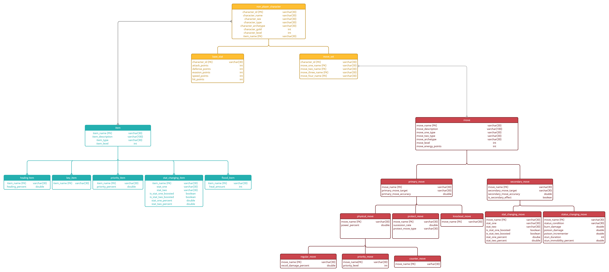

# GofRPG_API

## Table of Contents
1. [Author(s)](#author(s))
1. [Purpose](#purpose)
1. [Requirements](#requirements)
1. [Resources](#resources)
1. [Diagrams](#diagram)

## Author(s)
Eseroghene Omene

## Purpose
This API is for the coding project called Guardians of RPG. In Unity, it will be difficult to incorporate all of the game logic
for the game into a series of scripts, so most of the game logic will be stored into an API that the scripts will be able to call
on. The API is also important because it has a means of connecting to the guardians_of_rpg database, which is imperative for gathering
moves, items, and npcs for the game.

## Requirements
* API must be able to create and keep track of the player's information
* API must be able to save the player's information
* API must be able to update the player's information
* API must be able to update other npc information based on items and moves
* API must be able to gather information from database, and create objects based off that information

## Resources

* ### C#
  C# Sharp is the language of choice for the API. The reason for this is because I plan on using this API for Unity, and/or other gaming
  engine, and those engines only include C++ and C#.
  
* ### SQL
  SQL is my language for choice for the guardians_of_rpg database. SQL is a language that is ideal for creating a relational database,
  and there are libraries in C# that enable the code to connect to that program and gather queries from that database. In this repository,
  the SQL code will not be here (maybe text files that have the queries)
  
## Diagrams

### Relational Database Diagram

  
